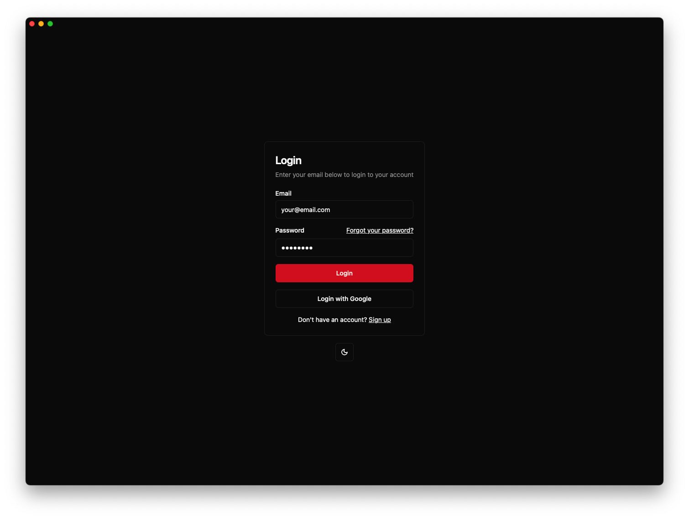
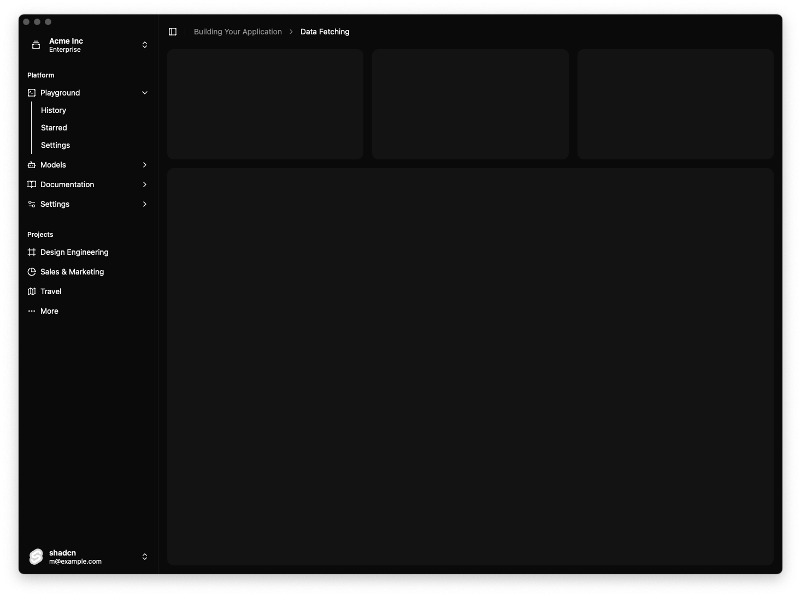

<h1 align="center">wails-template-shadcn-svelte</h1>
<p align="center">Wails template which includes: Shadcn, Svelte/kit out of the box</p>

## Preview

<div style="display: flex; justify-content: space-between;">
  
  
</div>

## Use this template

```bash
wails init -n my-wails-app -t https://github.com/xijaja/wails-template-shadcn-svelte
```

## Building

To build a redistributable, production mode package, use `wails build`.

## Other templates

- [wails-template-vite-solid-ts](https://github.com/xijaja/wails-template-solid-ts) - A template using Solid + Ts + Vite
- [wails-template-vite-solid-js](https://github.com/xijaja/wails-template-solid-js) - A template using Solid + Js + Vite
- [wails-template-solid-tailwindcss](https://github.com/xijaja/wails-template-solid-tailwindcss) - A wails template with a beautiful sidebar, using solid and tailwindcss
- [wails-template-vue3](https://github.com/xijaja/wails-template-vue3) - A wails template with a beautiful sidebar, using vue and tailwindcss
